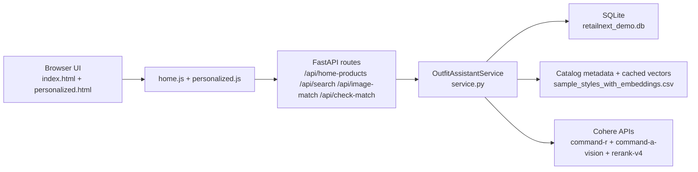

# GlobalMart Fashion Assistant Demo (Web + API + DB)

GlobalMart Fashion demo application for Cohere solution walkthroughs.

This version delivers a full stack:
- Frontend: storefront UI (desktop + mobile)
- Backend: FastAPI
- Persistence: SQLite (`data/retailnext_demo.db`)
- Retrieval: lexical candidate generation + Cohere rerank
- Multimodal AI: text search, image-guided search, and match scoring with Cohere models

## Documentation

- [Documentation Index](./docs/README.md)
- [Architecture](./docs/ARCHITECTURE.md)
- [Check Your Match Scoring](./docs/CHECK_YOUR_MATCH.md)
- [Troubleshooting Guide](./docs/TROUBLESHOOTING.md)

## High-Level Diagram



## Key Flows

1. Natural-language query search
- User enters query on home/personalized page.
- Service builds lexical candidates from catalog metadata.
- Cohere rerank orders candidates and returns top recommendations.

2. Image upload match
- User uploads image to `/api/image-match`.
- Cohere vision extracts structured attributes + search queries.
- Service runs retrieval/rerank and returns recommendations.

3. Check Your Match
- Deterministic signal scoring runs for explainability.
- Optional Cohere judgement augments verdict/rationale.
- Result is persisted and shown inline + modal.

## Project Structure

```text
retailnext_outfit_assistant/
  app/
    api_server.py
    web/
      index.html
      personalized.html
      styles.css
      home.js
      personalized.js
  data/
    sample_clothes/
    retailnext_demo.db
  scripts/
    run_api_dev.sh
    download_sample_clothes.py
  src/retailnext_outfit_assistant/
    catalog.py
    retrieval.py
    cohere_utils.py
    db.py
    service.py
```

## Quickstart

### 1) Install

```bash
cd retailnext_outfit_assistant
python3 -m venv .venv
./.venv/bin/pip install --upgrade pip
./.venv/bin/pip install -r requirements.txt
./.venv/bin/pip install -e .
```

### 2) Configure environment

```bash
cp .env.template .env
# Set COHERE_API_KEY
```

### 3) Download sample data

```bash
./.venv/bin/python scripts/download_sample_clothes.py
```

### 4) Run backend + frontend

```bash
chmod +x scripts/run_api_dev.sh
./scripts/run_api_dev.sh
```

Port behavior:
- Default `PORT=8005`
- Auto-selects next free port in `8005..8009`
- Exits with a clear message if all ports in range are occupied

Open the exact URL printed in terminal (typically `http://127.0.0.1:8005`).

## API Endpoints

- `GET /api/health`
- `GET /api/profile`
- `GET /api/home-products?limit=24&gender=Women|Men`
- `POST /api/search`
- `POST /api/image-match`
- `GET /api/personalized/{session_id}`
- `POST /api/check-match`
- `GET /api/image/{product_id}`
- `POST /api/transcribe` (backend fallback; browser voice transcription is handled client-side via Web Speech API)

## Environment Variables

Required:
- `COHERE_API_KEY`

Optional:
- `COHERE_API_BASE_URL` (default `https://api.cohere.com/v2`; set private endpoint here for private networking)
- `RN_CHAT_MODEL` (default `command-r-08-2024`)
- `RN_VISION_MODEL` (default `command-a-vision-07-2025`)
- `RN_RERANK_MODEL` (default `rerank-v4.0-fast`)
- `RN_COHERE_TIMEOUT_SECONDS`
- `RN_COHERE_MAX_RETRIES`
- `RN_AI_REQUEST_TIMEOUT_SECONDS`
- `RN_AI_SEARCH_TIMEOUT_SECONDS`
- `RN_AI_IMAGE_TIMEOUT_SECONDS`
- `RN_AI_MATCH_TIMEOUT_SECONDS`
- `RN_SEARCH_CANDIDATE_POOL`

## Notes

- If local `sample_images` are missing, the image route falls back to GitHub image URLs.
- If `COHERE_API_KEY` is missing, text search falls back to lexical ranking and image flow falls back to random recommendations.
- Match scoring always returns heuristic details; Cohere judgement is additive when available.
- Voice search uses browser-native speech recognition when supported (`SpeechRecognition` / `webkitSpeechRecognition`).
