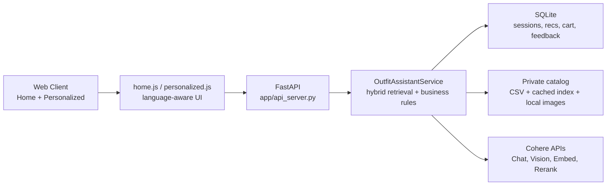

# GlobalMart Fashion Assistant 

Private e-commerce AI assistant demo for GlobalMart Fashion, built with Cohere models for search relevance, reranking, and multimodal discovery.

## Architecture Diagram



For a deeper walkthrough, see [`docs/ARCHITECTURE.md`](./docs/ARCHITECTURE.md).

## Core Capabilities

- Hybrid retrieval (`lexical + dense + RRF + Cohere rerank`)
- Natural language search and image-upload matching
- Voice transcription path with browser-first and backend fallback behavior
- AI Explain + Suggest (Complete the Look) + Buy actions
- Cart/profile/footer content backed by real API routes
- Multilingual UX and API responses (`en`, `ja`, `zh`, `es`)
- Private-endpoint-ready Cohere configuration path

## Quickstart

### 1) Install

```bash
cd /Users/timothycllam/Documents/llm_sandbox/cohere/assignment
python3 -m venv .venv
./.venv/bin/pip install --upgrade pip
./.venv/bin/pip install -r requirements.txt
./.venv/bin/pip install -e .
```

### 2) Configure

```bash
cp .env.template .env
# Set COHERE_API_KEY in .env
```

Optional private Cohere endpoint config:
- Set `RN_COHERE_CONFIG_PATH` to a JSON file.
- Supported keys: `api_key`, `base_url`, `timeout_seconds`, `max_retries`.

### 3) Prepare sample data (if needed)

```bash
./.venv/bin/python scripts/download_sample_clothes.py
```

### 4) Run

```bash
./scripts/run_api_dev.sh
```

Port behavior:
- Default `PORT=8005`
- Auto-selects next free port in `8005..8009`
- Exits clearly if all ports in range are occupied

## API Surface

- `GET /api/health`
- `GET /api/languages`
- `GET /api/home-products?limit=24&gender=Women|Men&lang=en|ja|zh|es`
- `POST /api/search`
- `POST /api/image-match`
- `GET /api/personalized/{session_id}?lang=en|ja|zh|es`
- `POST /api/complete-look`
- `POST /api/suggest-session`
- `POST /api/transcribe`
- `GET /api/profile?shopper_name=...&lang=en|ja|zh|es`
- `GET /api/cart?shopper_name=...&lang=en|ja|zh|es`
- `POST /api/cart/add`
- `POST /api/cart/remove`
- `POST /api/feedback`
- `GET /api/content/{slug}?lang=en|ja|zh|es`
- `GET /api/image/{product_id}`

## Scripts

- `scripts/run_api_dev.sh`: starts the FastAPI app with guarded port selection (`8005..8009`) and stale-process cleanup.
- `scripts/download_sample_clothes.py`: validates or extracts required catalog files into `data/sample_clothes/`.
- `scripts/evaluate_retrieval.py`: compares lexical baseline vs hybrid retrieval and writes `docs/eval_last_run.json`.
- `scripts/build_retailnext_assignment_deck.py`: writes deck build notes into `deliverables/`.
- `scripts/capture_retailnext_screens.js`: helper placeholder for deterministic screenshot capture targets.

## Documentation

- [Documentation Index](./docs/README.md)
- [Architecture](./docs/ARCHITECTURE.md)
- [Demo Runbook](./docs/DEMO_RUNBOOK.md)
- [Troubleshooting Guide](./docs/TROUBLESHOOTING.md)
