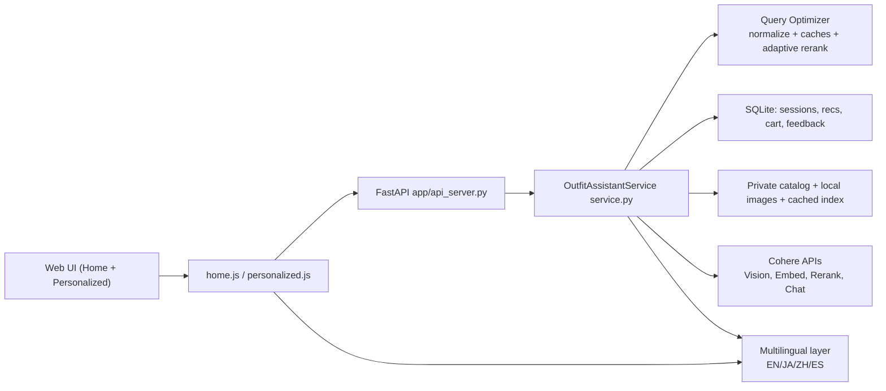

# GlobalMart Fashion x Cohere: 45-Minute Presentation Content

## 1. Title Slide
- Title: GlobalMart Fashion Intelligent Personal Shopper (Cohere-based)
- Subtitle: Recovering conversion with secure, relevant, multimodal product discovery
- Presenter role: Cohere Solution Architect

## 2. Executive Summary
- Business issue: rising bounce rate and lower session depth after competitor launched an intelligent shopper.
- Root cause: weak personalization and low query relevance.
- Solution: Cohere-first hybrid retrieval + multimodal assistant + explainable recommendations.
- Outcome target: improve relevance, engagement, and conversion while preserving private data boundaries.

## 3. Customer Problem Framing
- Symptoms:
  - users leave early
  - fewer product interactions
  - low trust in search quality
- Constraints:
  - customer/catalog data must stay private
  - system must scale with predictable latency
- Success criteria:
  - better top-result relevance
  - more click/cart actions
  - stronger session continuity

## 4. Assumptions (Call Out Explicitly)
- Catalog is private and managed in enterprise-controlled storage.
- Cohere can be used through standard API or private endpoint configuration.
- Shopper context is session-first (expandable to long-term identity profile later).
- Human merchandising rules remain required alongside AI relevance.

## 5. Proposed Solution (One Slide)
- Core approach:
  - Hybrid retrieval (`lexical + dense + RRF + Cohere rerank`)
  - Multimodal entry points (text + voice + image)
  - Actionable card UX (`Explain`, `Suggest`, `Buy`)
  - Feedback loop (`click`, `cart_add`, `complete_look`) for personalization signals
- Privacy model:
  - private catalog + private session DB
  - no raw media persistence
  - optional private Cohere endpoint path

## 6. Architecture Diagram (Use As Slide Visual)

## 7. End-to-End Text Search Flow
1. User sends natural-language query (`POST /api/search`).
2. Service normalizes query (typo/synonym handling).
3. Intent extraction (heuristic first, Cohere parser when needed).
4. Candidate generation:
   - lexical metadata retrieval
   - dense embedding retrieval
5. Candidate fusion with RRF.
6. Cohere rerank (adaptive depth for latency control).
7. Business rules apply boosts/penalties (gender/article/usage/season/recency).
8. Recommendations persisted to session and returned for UI rendering.

## 8. End-to-End Image Match Flow
1. User uploads image (`POST /api/image-match`).
2. Cohere Vision extracts attributes + candidate search hints.
3. Service identifies a primary article type to avoid mixed-type drift.
4. Retrieval pipeline runs with article-focus guardrail.
5. Results returned with Explain/Suggest/Buy actions.

Talking point:
- This fixed a real issue where shirt uploads could drift to shoe-heavy results.

## 9. Explain / Suggest / Buy Feature Logic
- Explain:
  - shows why item matched user intent
  - includes user-friendly score bar (out of 100%)
- Suggest (Complete the Look):
  - anchors on selected item
  - prioritizes complementary article types and compatibility
- Buy:
  - updates cart and logs event for personalization analytics

## 10. Performance and Relevance Engineering
- Techniques implemented:
  - query normalization and token aliasing
  - intent cache
  - query embedding cache
  - adaptive candidate pool sizing
  - selective rerank for high-signal queries
- Result summary:
  - improved response speed for repeated and noisy queries
  - stronger relevance on typo-heavy natural language inputs

## 11. Multilingual Strategy (EN/JA/ZH/ES)
- UI labels and navigation localized.
- API supports `lang` across core endpoints.
- Non-English queries translated to English for retrieval consistency.
- Results returned with localized metadata and user-facing explanations.
- Optimization: template-based multilingual suggest/explain text avoids per-item translation overhead.

## 12. Security and Enterprise Readiness
- Data stays in private storage paths and local DB in this demo.
- Temporary voice blobs deleted after transcription.
- Sensitive payload logging minimized.
- Cohere private endpoint compatible through config:
  - `RN_COHERE_CONFIG_PATH`
  - supports `api_key`, `base_url`, timeout/retry settings.

## 13. Mapping Technical Components to Business Requirements
| Business Need | Implementation |
| --- | --- |
| Better relevance | Hybrid retrieval + rerank + rule controls |
| Faster user discovery | Adaptive retrieval depth + caches + streamlined UI actions |
| Intelligent shopper parity | Explain/Suggest/Buy with session continuity |
| Privacy/off public internet | Private catalog, SQLite session store, private endpoint path |
| Scalable architecture | Stateless API + cached indices + bounded latency controls |

## 14. Live Demo Script (Time-Boxed)
- 5 min: problem framing + architecture
- 10 min: text search + explain + buy
- 8 min: image upload + primary-article guardrail example
- 7 min: suggest (complete look) and rationale
- 5 min: multilingual switch (EN->JA->ZH)
- 5 min: reliability/security and fallback behaviors
- 5 min: metrics, Q&A

## 15. Sample Q&A Prep (Customer Persona Style)
- Q: How do you prevent irrelevant results?
  - A: hybrid retrieval + rerank + explicit business penalties for mismatch.
- Q: Can this run without exposing catalog data publicly?
  - A: yes, private catalog/data plane + private Cohere endpoint configuration path.
- Q: What if model latency spikes?
  - A: adaptive rerank, cache reuse, and lexical fallback keep experience usable.
- Q: How do we scale personalization?
  - A: current session signal capture is already in place; extend to feature store + user vectors next.

## 16. Next-Phase Roadmap (Optional Closing Slide)
- Add clickstream-informed long-term preference vectors.
- Introduce AB testing for rerank/business-rule weights.
- Move to production-grade vector database for larger catalogs.
- Add policy layer for compliance/audit controls by region.
