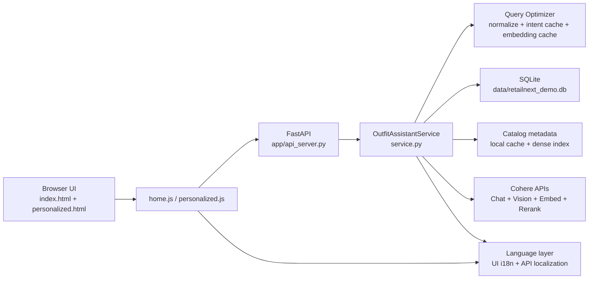

# Architecture

## System Overview

GlobalMart Fashion Assistant is a single FastAPI service that serves:
- Frontend pages (`/`, `/personalized`)
- API routes (`/api/*`)

Core components:
- SQLite for sessions, recommendation history, profiles, carts, and shopper feedback
- Local product catalog (`sample_styles_with_embeddings.csv`) with cached index artifacts
- Cohere APIs for intent parsing, embeddings, reranking, vision analysis, and optional match judgement
- Frontend flows for text search, voice query, image match, refine-session, and complete-the-look
- Multilingual layer for UI phrases + localized API payloads (`en`, `ja`, `zh`, `es`)
- Retrieval optimization layer with typo normalization, adaptive candidate sizing, and in-memory caches

## Component Diagram

## Retrieval Pipeline v2 (Cohere-first)

For recommendation generation:
1. Normalize raw query text (typo/synonym normalization, token aliasing).
2. Parse shopper intent (heuristic + optional Cohere structured intent extraction).
3. Reuse intent/query-embedding caches where available.
4. Generate lexical candidates from local metadata.
5. Generate dense candidates from Cohere embeddings + cosine similarity.
6. Fuse candidate lists with Reciprocal Rank Fusion (RRF).
7. Adapt rerank depth by query signal strength and run Cohere rerank when beneficial.
8. Apply business controls:
   - gender alignment
   - article/usage/season preference boosts
   - explicit penalties for mismatch when query carries strong intent
   - optional recency boost by product year
9. Return recommendations with explanation chips.

Performance note:
- For multilingual Suggest (`/api/complete-look`), explanation and assistant-note localization uses fast templates/term maps (not per-item LLM translation) to keep latency close to English.
- For repeated/related queries, intent and query-embedding caches remove redundant model calls.

## Primary Runtime Flows

### Multilingual Request Flow

1. Frontend chooses a language from the header flag selector.
2. Frontend appends `lang` to API calls and page URLs.
3. Service localizes display metadata and narrative fields.
4. For non-English text search, service translates query to English (Cohere) before hybrid retrieval.
5. Recommendations are returned in localized display format while ranking logic remains consistent.

### Text Search

1. Frontend posts `/api/search`.
2. Service runs retrieval v2 and stores session + ranked items.
3. Frontend loads `/api/personalized/{session_id}`.

### Image Match

1. Frontend uploads to `/api/image-match`.
2. Cohere vision extracts image attributes + candidate queries.
3. Service selects a primary article type (for mixed outputs like `Tshirts + Shoes`) and anchors ranking to that type.
4. Service runs retrieval v2, applies article-focus guardrails, and persists session.
5. Personalized recommendations are returned with explanations.

### Session Refine

1. Frontend posts `/api/refine-session` with refinement (`party`, `work`, `casual`).
2. Service creates a refined query from the prior session context.
3. Retrieval v2 runs again and a new session is stored.

### Complete the Look

1. Frontend posts `/api/complete-look` for a selected recommendation.
2. Service builds a complementary query and excludes the anchor item.
3. Returns additional compatible recommendations + explanation chips.

## Reliability and Security Notes

- Voice path uses browser speech first, then recorder-to-backend fallback.
- Uploaded voice blobs are written to temporary files only for transcription and deleted immediately.
- Sensitive payloads are not persisted in logs.
- Cohere base URL can be set directly (`COHERE_API_BASE_URL`) or via private config JSON (`RN_COHERE_CONFIG_PATH`).
- Dev launcher enforces/rotates ports in range `8005..8009`.

## Requirement Mapping

| Business Requirement | Technical Implementation |
| --- | --- |
| Improve relevance and reduce early abandonment | Hybrid retrieval (lexical + dense + RRF + Cohere rerank) with business controls in `service.py` |
| Support intelligent personal shopper behavior | Sessionized recommendations, Explain/Suggest/Buy actions, profile/cart feedback loops |
| Keep customer data off public internet | Private local catalog + SQLite; no public indexing of customer data; optional private Cohere endpoint config |
| Scale with predictable latency | Dense cache, intent cache, query-embedding cache, adaptive candidate/rerank depth |
| Support global shoppers | Multilingual frontend and localized API responses (`en`, `ja`, `zh`, `es`) |
