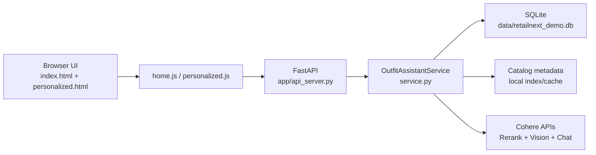

# Architecture

## System Overview

GlobalMart Fashion Assistant is a single FastAPI service that serves both:

- Frontend pages (`/` and `/personalized`)
- API routes (`/api/*`)

The application uses:

- SQLite for sessions, recommendation storage, and match checks
- Local catalog metadata loaded from `sample_styles_with_embeddings.csv`
- Cohere APIs for reranking, vision analysis, and optional match judgement
- Heuristic fallback logic for graceful degradation when AI requests fail

## Component Diagram

## Main Runtime Flows

### Natural Language Search

1. Frontend posts `/api/search` with query text.
2. Service creates lexical candidates from local catalog metadata.
3. Service calls Cohere rerank to order candidates.
4. Session and recommendation rows are persisted in SQLite.
5. Frontend loads `/api/personalized/{session_id}`.

### Image Upload Match

1. Frontend uploads image to `/api/image-match`.
2. Service sends image + prompt to Cohere vision model.
3. Vision output yields structured fields and search queries.
4. Retrieval/rerank returns ranked recommendations.
5. Session + recommendations are persisted and returned.

### Check Your Match

1. Frontend posts `/api/check-match` with `session_id` and `product_id`.
2. Service computes deterministic heuristic breakdown by signals.
3. If AI is available, Cohere chat adds verdict/rationale refinement.
4. Match result is stored in DB and shown inline + in modal.

## Reliability Design

- Request timeouts are enforced with configurable `RN_AI_*_TIMEOUT_SECONDS` values.
- If Cohere calls fail or timeout, service falls back to deterministic behavior.
- Dev runner supports port range `8005..8009` to avoid local collisions.
- Frontend uses same-origin API calls to prevent split-port fetch failures.
